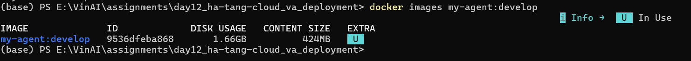
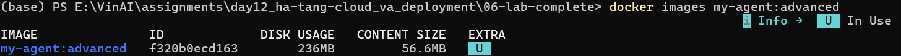
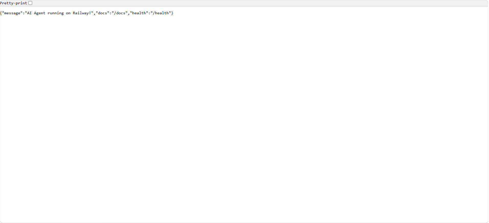
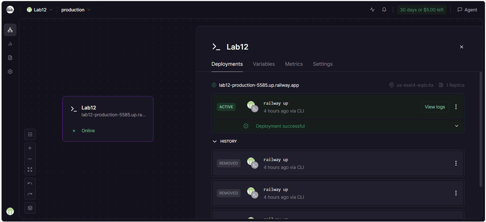

# Day 12 Lab - Mission Answers
> **Student Name:** Mạc Phạm Thiên Long
> 
> **Student ID:** 2A202600384
> 
> **Date:** 2026-04-17

## Part 1: Localhost vs Production

### Exercise 1.1: Anti-patterns found
1. Lộ Hardcoded secrets: Các biến OPENAI_API_KEY và DATABASE_URL (chứa cả credential của PostgreSQL) được gắn cứng ngay trong source code -> rủi ro bảo mật nghiêm trọng; nếu code được push lên GitHub, key sẽ bị quét và bị lạm dụng ngay lập tức. Các thông tin này bắt buộc phải được nạp qua biến môi trường (Environment variables) hoặc các secret manager.
2. Thiếu hệ thống quản lý cấu hình: Các tham số hệ thống như DEBUG = True hay MAX_TOKENS = 500 đang bị hardcode. Khi vận hành hệ thống AI thực tế qua nhiều môi trường (Dev, Staging, Prod), thiết kế này triệt tiêu khả năng thay đổi hành vi của agent nếu không sửa trực tiếp source code. Giải pháp chuẩn là sử dụng các thư viện như pydantic-settings kết hợp file .env.
3. Sử dụng print sai mục đích và rò rỉ secret qua Log: Việc dùng print thay vì thư viện logging chuẩn (như loguru hoặc module logging của Python) khiến hệ thống không thể phân loại log (INFO, WARN, ERROR) khi monitor. Hơn nữa, dòng code print(f"[DEBUG] Using key: {OPENAI_API_KEY}") trực tiếp đẩy secret ra standard output, khiến key bị lưu lại vĩnh viễn trên các hệ thống thu thập log.
4. Không có health check endpoint: Ứng dụng hoàn toàn thiếu một route định tuyến trạng thái (ví dụ /health hoặc /ping). Khi agent được đóng gói chạy dưới dạng container (như Docker) hoặc quản lý bởi các cloud platform, hệ thống điều phối bắt buộc phải gọi endpoint này để kiểm tra xem tiến trình có đang phản hồi không. Nếu không có, hệ thống sẽ không biết để tự động restart khi agent bị crash hoặc treo.
5. Gắn cứng cấu hình khởi chạy mạng (Host, Port, Reload): * host="localhost": Khiến ứng dụng chỉ nhận request nội bộ, không thể giao tiếp ra ngoài (đặc biệt lỗi khi chạy trong container, host bắt buộc phải là 0.0.0.0).

port=8000: Gây xung đột và lỗi deploy trên các nền tảng cloud (như Railway) vì các hệ thống này yêu cầu ứng dụng listen trên một port động được cấp phát qua biến môi trường PORT.

reload=True: Đây là tính năng chỉ dành cho môi trường phát triển (Local/Dev). Nếu để lọt ra production, nó sẽ theo dõi file system liên tục, gây hao tổn tài nguyên nghiêm trọng và rò rỉ bộ nhớ.
...

### Exercise 1.3: Comparison table
### 2. So sánh Basic vs Advanced (12-Factor Compliant Agent)

| Feature | Basic | Advanced | Tại sao quan trọng? |
| :--- | :--- | :--- | :--- |
| **Config** | Hardcode | Env vars (`config.settings`) | Đảm bảo bảo mật thông tin nhạy cảm. Cho phép thay đổi hành vi hệ thống linh hoạt trên đa môi trường mà không cần sửa đổi source code. |
| **Health check** | Không có | Có (`/health`, `/ready`) | Là cơ chế giao tiếp bắt buộc với hệ thống điều phối (Kubernetes, Docker). Giúp tự động nhận diện agent bị treo để restart, hoặc chặn traffic vào agent chưa tải xong. |
| **Logging** | `print()` | Structured JSON (`logging`) | Cho phép phân loại mức độ sự kiện. Định dạng JSON giúp các công cụ (Datadog, ELK) dễ dàng parse, truy vấn và thiết lập cảnh báo tự động. Tránh rò rỉ secret. |
| **Shutdown** | Đột ngột | Graceful (Lifespan, SIGTERM) | Tránh tình trạng mất request khi hệ thống scale down. Cho phép agent có thời gian hoàn tất các request đang xử lý và đóng an toàn kết nối database/API. |
| **Network & Binding** | Cố định (`localhost:8000`, `reload=True`) | Động (`0.0.0.0`, port từ `$PORT`) | `0.0.0.0` bắt buộc để nhận traffic ngoài container. Port động giúp nền tảng Cloud tự động cấp phát không gây xung đột. Tắt `reload` tiết kiệm tài nguyên. |

## Part 2: Docker

### Exercise 2.1: Dockerfile questions
### 1. Base image là gì?
Base image được sử dụng trong file là `python:3.11`. Đây là bản phân phối đầy đủ (full distribution) của Python, có dung lượng khá lớn (khoảng 1 GB).

### 2. Working directory là gì?
Working directory (thư mục làm việc mặc định bên trong container) được thiết lập là `/app`. Mọi câu lệnh `COPY`, `RUN`, hay `CMD` phía sau sẽ được thực thi tại thư mục này.

### 3. Tại sao COPY requirements.txt trước?
Thao tác này nhằm tối ưu hóa cơ chế **Docker layer cache**. 

Trong quá trình develop, mã nguồn ứng dụng sẽ thay đổi liên tục, trong khi danh sách các thư viện (`requirements.txt`) ít bị cập nhật hơn. Bằng cách copy `requirements.txt` và chạy `pip install` trước, Docker sẽ lưu lại (cache) layer chứa các thư viện này. Nếu lần build tiếp theo chỉ sửa code (không sửa `requirements.txt`), Docker sẽ sử dụng lại cache cũ thay vì phải tải và cài đặt lại toàn bộ thư viện từ đầu, giúp tiết kiệm tối đa thời gian build.

### 4. CMD vs ENTRYPOINT khác nhau thế nào?

- **CMD (Command):** Định nghĩa lệnh và tham số mặc định khi container khởi chạy. Điểm yếu là nó **rất dễ bị ghi đè** (override). Ví dụ: nếu bạn chạy `docker run <image_name> /bin/bash`, lệnh `/bin/bash` sẽ lập tức thay thế hoàn toàn lệnh `python app.py`.
- **ENTRYPOINT:** Cấu hình container chạy như một file thực thi cố định. Lệnh trong `ENTRYPOINT` **không bị ghi đè** bởi các tham số truyền qua `docker run` (trừ khi cố tình dùng cờ `--entrypoint`). Các tham số từ `docker run` sẽ được tự động nối vào phía sau chuỗi lệnh của `ENTRYPOINT` như những arguments phụ. 

**Best practice:** Thường dùng `ENTRYPOINT` để khai báo tệp thực thi chính (vd: `ENTRYPOINT ["python", "app.py"]`) và dùng `CMD` để truyền các tham số mặc định có thể thay đổi được (vd: `CMD ["--port", "8000"]`).

### Exercise 2.3: Image size comparison
- Develop: 1.66 GB
<p align="center">
  
</p>
- Production: 236 MB
<p align="center">
  
</p>
- Difference: 85.8%

## Part 3: Cloud Deployment

### Exercise 3.1: Railway deployment
- URL: https://lab12-production-5585.up.railway.app
- Screenshot:
<p align="center">
  
</p>
- Deployment status:
<p align="center">
  
</p>

## Part 4: API Security

### Exercise 4.1-4.3: Test results
- **Lần 1: Không có key**
  - Câu lệnh: `curl.exe -i -X POST -H "Content-Type: application/json" -d '{"question":"hello"}' http://localhost:8000/ask`
  - Kết quả: `HTTP/1.1 401 Unauthorized`.
  - Log output:
    ```json
    {"detail":"Invalid or missing API key. Include header: X-API-Key: <key>"}
    ```
- **Lần 2: Có key "demo-key-123"**
  - Câu lệnh: `curl.exe -i -X POST -H "X-API-Key: demo-key-123" -H "Content-Type: application/json" -d '{"question":"Hello"}' http://localhost:8000/ask`
  - Kết quả: `HTTP/1.1 200 OK`.
  - Log output:
    ```json
    {
      "question": "Hello",
      "answer": "Chào bạn, tôi là Chuyên gia Tâm lý AI. Tôi luôn sẵn lòng lắng nghe bạn.",
      "usage": { "prompt_tokens": 2, "completion_tokens": 40, "total_tokens": 42, "cost": 0.000027 }
    }
    ```

#### Ex 4.2: JWT Authentication Flow
1. **Lấy Token**: Gửi username/password tới endpoint `/auth/token`.
   - Log output (Success):
     ```json
     {
       "access_token": "eyJhbGciOiJIUzI1NiIs...",
       "token_type": "bearer",
       "expires_in_minutes": 60
     }
     ```
2. **Sử dụng Token**: Token được đính kèm vào header `Authorization: Bearer <token>`.
3. **Xác thực**: Server giải mã token để lấy thông tin người dùng.

#### Ex 4.3: Rate Limiting
- **Kết quả test**: Khi gọi API liên tục 15 lần, từ request thứ 11 hệ thống trả về:
  - Log output (429):
    ```json
    {
      "detail": {
        "error": "Rate limit exceeded",
        "limit": 10,
        "window_seconds": 60,
        "retry_after_seconds": 59
      }
    }
    ```

### Exercise 4.4: Cost guard implementation
- **Cách tiếp cận**: Hệ thống theo dõi chi phí sử dụng LLM dựa trên số lượng token của input và output. 
- **Logic thực hiện**:
  1. Mỗi người dùng có một hạn mức ngân sách hàng ngày (ví dụ: $1.0/ngày).
  2. Trước khi gọi LLM, hệ thống kiểm tra ngân sách còn lại. Nếu đã hết, trả về lỗi `402 Payment Required`.
  3. Sau khi LLM phản hồi, hệ thống tính toán chi phí (dựa trên giá của model như gpt-4o-mini) và trừ vào ngân sách của người dùng đó.
  4. Có hệ thống cảnh báo (Warning log) khi người dùng sử dụng vượt quá 80% hạn mức.
- **Lợi ích**: Bảo vệ hệ thống khỏi việc bị lạm dụng hoặc các hóa đơn API LLM tăng đột biến ngoài ý muốn.

## Part 5: Scaling & Reliability

### Exercise 5.1-5.5: Implementation notes

#### 1. Health Checks (Liveness & Readiness)
- **Liveness Probe (`/health`)**:
  - Log output:
    ```json
    {
      "status": "ok",
      "version": "1.0.0",
      "environment": "staging",
      "uptime_seconds": 15.2,
      "checks": { "llm": "mock" }
    }
    ```
- **Readiness Probe (`/ready`)**:
  - Log output:
    ```json
    { "ready": true }
    ```

#### 2. Graceful Shutdown
- Khi nhận tín hiệu `SIGTERM` (từ Docker hoặc Cloud platform), agent sẽ không ngắt kết nối ngay lập tức.
- Thay vào đó, nó sẽ chuyển trạng thái `ready` thành `false` để Load Balancer ngừng gửi request mới, sau đó đợi các request hiện tại xử lý xong (tối đa 30 giây) rồi mới đóng ứng dụng một cách an toàn.

#### 3. Stateless Design
- **Vấn đề**: Việc lưu lịch sử hội thoại (conversation history) trong biến bộ nhớ (in-memory) sẽ gây lỗi khi hệ thống scale lên nhiều instance. Mỗi request có thể đến một instance khác nhau không chứa history đó.
- **Giải pháp**: Chuyển toàn bộ state (history, rate limit counter) sang **Redis**. Điều này giúp các agent instance có thể thay thế lẫn nhau mà không làm mất context của người dùng.

#### 4. Load Balancing & Scaling
- Sử dụng Nginx làm Load Balancer để phân tán traffic đều cho các agent instance.
- Khi một instance bị lỗi, Load Balancer tự động nhận biết qua health check và điều hướng traffic sang các instance còn lại, đảm bảo tính sẵn sàng cao (High Availability).

